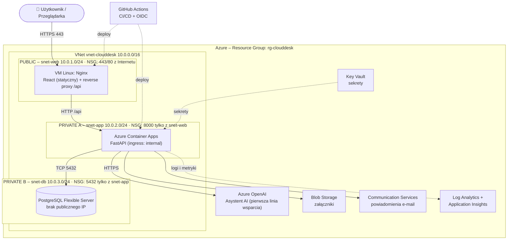

# CloudDesk

**System zgłoszeń IT z SLA i asystentem AI, w trójwarstwowej architekturze w Microsoft Azure.**

Projekt zespołowy „Aplikacja w wybranej chmurze publicznej”, Uniwersytet WSB Merito Wrocław, 2026/2027.

> Status: 🚧 w budowie (Blok 2: szkielet repozytorium i architektura)

## Spis treści
- [O projekcie](#o-projekcie)
- [Zespół](#zespół)
- [Stos technologiczny](#stos-technologiczny)
- [Architektura](#architektura)
- [Struktura repozytorium](#struktura-repozytorium)
- [Uruchomienie lokalne](#uruchomienie-lokalne)
- [Sposób pracy](#sposób-pracy)
- [Roadmapa](#roadmapa)

## O projekcie
CloudDesk to helpdesk IT oparty na cyklu życia incydentu ITIL.

**Jak działa:**
- Pracownik zgłasza problem. System nadaje mu priorytet (P1–P4) i odlicza czas SLA.
- Technik prowadzi zgłoszenie przez kolejne statusy, a każda zmiana trafia do historii.
- **Asystent AI zaczyna pomagać od razu.** Zanim specjalista przejmie zgłoszenie, asystent oparty na Azure OpenAI analizuje opis problemu i w czacie proponuje kroki naprawcze.
- Jeśli porada pomoże, użytkownik sam zamyka zgłoszenie. Jeśli nie, cała rozmowa z AI trafia do technika jako kontekst.

**Kluczowe funkcje:**
- rejestracja i logowanie z rolami: Zgłaszający, Technik, Administrator;
- CRUD zgłoszeń z walidacją po stronie klienta i serwera;
- statusy ITIL: Nowe → Przypisane → W toku → Rozwiązane → Zamknięte, z pełnym audytem zmian;
- priorytety P1–P4 z terminami SLA i ostrzeżeniem „SLA zagrożone”;
- wyszukiwanie, filtrowanie i paginacja listy zgłoszeń;
- czat z asystentem AI dołączony do każdego zgłoszenia;
- załączniki w Azure Blob Storage i powiadomienia e-mail;
- dashboard SLA: liczba zgłoszeń, MTTR, naruszenia SLA.

## Zespół
| Rola | Osoba | GitHub |
|---|---|---|
| Project Manager / DevOps | _…_ | _…_ |
| Frontend | _…_ | _…_ |
| Backend | _…_ | _…_ |
| Database (DBA) | _…_ | _…_ |

## Stos technologiczny
| Warstwa | Technologie |
|---|---|
| Frontend | React 19, TypeScript, Vite, Nginx |
| Backend | Python 3.12, FastAPI, Pydantic (DTO), SQLAlchemy 2, Alembic |
| Baza danych | PostgreSQL 16 (Azure Database for PostgreSQL Flexible Server) |
| AI | Azure OpenAI |
| Chmura | Microsoft Azure: VNet, NSG, Virtual Machine, Container Apps, Blob Storage, Key Vault, Communication Services, Log Analytics |
| IaC / CI/CD | Terraform, GitHub Actions (OIDC) |

## Architektura
Trójwarstwowa architektura z izolacją sieciową. Ruch przechodzi kaskadowo przez kolejne warstwy:

| Warstwa | Podsieć | Komponent | Kto może się połączyć |
|---|---|---|---|
| 1. Dostępowa (WEB) | `snet-web` 10.0.1.0/24, **publiczna** | VM z Nginx: frontend React + reverse proxy `/api` | Internet: 443 (80 → przekierowanie) |
| 2. Logiki (APP) | `snet-app` 10.0.2.0/24, **prywatna** | Azure Container Apps: FastAPI | tylko `snet-web`, port 8000 |
| 3. Danych (DB) | `snet-db` 10.0.3.0/24, **prywatna** | PostgreSQL Flexible Server | tylko `snet-app`, port 5432 |



Źródło diagramu: [`docs/diagrams/architecture.mmd`](docs/diagrams/architecture.mmd).

**Wzorce w kodzie:**
- **MVC:** widoki React, routery FastAPI jako kontrolery, modele SQLAlchemy;
- **Repository:** dostęp do bazy wyłącznie przez `app/repositories`;
- **DTO:** schematy Pydantic w `app/schemas`, przenoszące dane między backendem a frontendem.

## Struktura repozytorium
```
clouddesk/
├── frontend/          # React + Vite (warstwa prezentacji)
├── backend/           # FastAPI (warstwa logiki)
│   └── app/
│       ├── api/routes/    # kontrolery REST
│       ├── core/          # konfiguracja ze zmiennych środowiskowych
│       ├── db/            # połączenie z bazą
│       ├── models/        # modele ORM
│       ├── schemas/       # DTO (Pydantic)
│       ├── repositories/  # wzorzec Repository
│       └── services/      # logika biznesowa (SLA, asystent AI)
├── config/            # konfiguracje lokalne: docker-compose (PostgreSQL), nginx
├── terraform/         # infrastruktura Azure jako kod
├── docs/              # deklaracja, diagramy, dokumentacja
└── .github/workflows/ # CI/CD oraz Claude Code
```

## Uruchomienie lokalne
Wymagania: Node.js 20+, Python 3.12+, Docker.

```bash
# 1. Baza danych
docker compose -f config/docker-compose.yml up -d

# 2. Backend – http://localhost:8000/docs
cd backend
cp .env.example .env
python -m venv .venv && source .venv/bin/activate
pip install -r requirements-dev.txt
uvicorn app.main:app --reload

# 3. Frontend – http://localhost:5173
cd frontend
cp .env.example .env.local
npm install
npm run dev
```

Testy i lint:
```bash
cd backend && pytest && ruff check .
cd frontend && npm run lint && npm run build
```

**Konfiguracja:** wyłącznie przez zmienne środowiskowe. Wzory są w plikach `.env.example`. Pliki `.env` nigdy nie trafiają do repozytorium.

## Sposób pracy
- Zadania śledzimy w **GitHub Projects** (kolumny: Todo → In Progress → In Review → Done). Każde zadanie to Issue z przypisaną osobą.
- Każda zmiana powstaje na osobnej gałęzi (`feature/…`, `fix/issue-N`). Potem idzie Pull Request z `Closes #N`, review innej osoby i merge do `main`.
- Commity są małe, a ich opisy czytelne.
- W Issue lub PR można wywołać **Claude Code**, pisząc komentarz `@claude …`.

## Roadmapa
| Blok | Zakres | Status |
|---|---|---|
| 1–2 | Zespół, deklaracja, repo, Kanban, architektura | 🚧 |
| 3 | Konto Azure, IAM + MFA, VNet i podsieci, NSG, Terraform | ⏳ |
| 4 | Frontend: lista zgłoszeń, hosting w warstwie WEB | ⏳ |
| 5 | Backend: CRUD zgłoszeń, walidacja, PostgreSQL | ⏳ |
| 6 | Integracja UI ↔ API, stany ładowania i błędów | ⏳ |
| 7–8 | CI (skanery bezpieczeństwa) i CD do Azure | ⏳ |
| 9 | Hardening, HTTPS | ⏳ |
| 10 | FinOps, monitoring, /health | ⏳ |
| 11 | Testy API i E2E (Playwright) | ⏳ |
| 12–14 | Code freeze, v1.0.0, dokumentacja, próba generalna | ⏳ |
